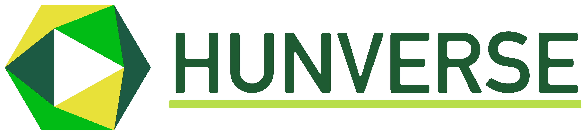
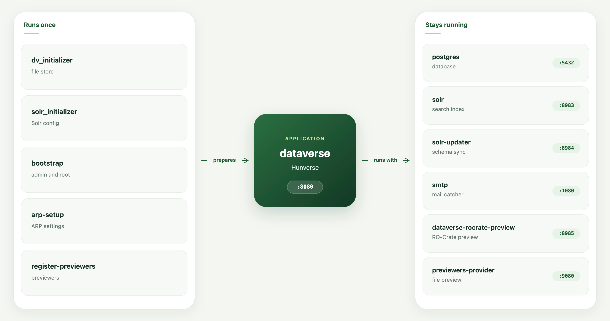

# Hunverse

[English](README.hunverse.md) · [Magyar](README.hunverse.hu.md)



Hunverse — the Hungarian Dataverse.

In the Adatrepozitórium Platform (ARP) project we built a service environment on the Dataverse research data repository software. At its center is a version of Dataverse extended with our own developments and localized for Hungarian, complemented by other services: a schema registry, an RO-Crate editor, and a common search.

Hunverse is the open-source release of this extended Dataverse software, made for the Hungarian research community.

It matches the instance running in ARP in every respect. Any researcher or institution can now install and use it with the ARP service integrations included by default. Every Hunverse user works with schemas stored in the same schema registry and can share those schemas with others. They can describe their data in more detail with RO-Crate — down to the file level — in the way already familiar from ARP. Data packages created in a Hunverse installation automatically become searchable in the [ARP Common Search](https://search.researchdata.hu), the federated collection point for Hungarian research data.

Hunverse can be customized for each institution, both in appearance and in some of its services, using the options Dataverse provides by default. Custom authentication, a persistent identifier service, or other convenience add-ons can be installed as needed.

The ARP project continuously keeps Hunverse up to date with newer Dataverse releases.

This Docker Compose stack is made to let the users run Hunverse on their systems. The stack uses the hosted CEDAR registry at https://cedar.schema.researchdata.hu and the self-hosted AROMA UI at `/aroma`.

## Components

`hunverse-compose.yml` starts twelve services on one Docker network. The diagram reads left to right: jobs that run once, the Dataverse application, then the services that stay up with it.



**dataverse** is the Hunverse application. The repository UI and API listen on port 8080, and JMX listens on 8686. AROMA, the RO-Crate editor, is served by the same application at `/aroma`. Uploaded files and language bundles are stored on the `dv_data` volume.

**postgres** is PostgreSQL 16 on port 5432. It stores collections, datasets, users, and settings.

**solr** is Solr 9.8 on port 8983. It holds the search index in `collection1`. 

**solr-updater**, on host port 8984, keeps that index schema in step with Dataverse metadata fields. The two services share the Solr data volume.

**smtp** is a test inbox (MailDev). On a local trial, signup links and password resets show up at http://localhost:1080 and disappear when the container stops. When other people use the site, point Hunverse at your own mail server instead. See [Mail](#mail).

**dataverse-rocrate-preview**, on port 8985, builds RO-Crate previews when Dataverse asks for them. 

**previewers-provider**, on port 9080, hosts the file previewers used in the browser.

**dv_initializer** prepares the file-store volume and the language-bundle directory before Dataverse starts. 

**solr_initializer** prepares the Solr volume and copies its config. 

**bootstrap** then creates the `dataverseAdmin` user and the root collection. 

**arp-setup** writes the Hunverse settings — English and Magyar, branding, CEDAR, terminology, and the AROMA address — and imports CEDAR templates when an API key is set. 

**register-previewers** registers the file previewers with Dataverse.

The CEDAR schema registry, the terminology service, and the language packs are not containers in this file. The stack calls them over the network.

## Running

### Prerequisites

Install these tools before you download the files or start the stack:

- [Docker](https://docs.docker.com/get-docker/), including the Compose plugin (`docker compose`). Docker Desktop includes it. On Linux, install Docker Engine and the `docker-compose-plugin` package.
- [curl](https://curl.se/), used in the download commands below.

The host needs outbound internet access so Compose can pull the images and Hunverse can reach the CEDAR registry, the terminology service, and the language packs.

To run the stack you do not need to download the whole repository. Just download these two files into an empty directory, then follow the steps below.

- [hunverse-compose.yml](https://raw.githubusercontent.com/dsd-sztaki-hu/dataverse/refs/heads/hunverse-6.9/hunverse-compose.yml)
- [.env.example](https://raw.githubusercontent.com/dsd-sztaki-hu/dataverse/refs/heads/hunverse-6.9/.env.example)

```bash
mkdir hunverse && cd hunverse
curl -fsSLO https://raw.githubusercontent.com/dsd-sztaki-hu/dataverse/refs/heads/hunverse-6.9/hunverse-compose.yml
curl -fsSLO https://raw.githubusercontent.com/dsd-sztaki-hu/dataverse/refs/heads/hunverse-6.9/.env.example
```

Most settings have defaults, so the stack can be started right after you copy `.env.example` to `.env` and set your `ARP_CEDAR_PROXY_API_KEY`.

```bash
cp .env.example .env
```

### Docker limits for production

Set Docker's memory and disk before you start the stack. `hunverse-compose.yml` does not set a memory limit on the Dataverse container. The memory you give Docker is the limit for the whole stack.

Payara sizes the Java heap to 70% of the RAM it can see (`MaxRAMPercentage=70`). On Docker Desktop, set that RAM under Settings → Resources → Memory. On Linux, it is the host's RAM.

`/tmp` and `/dumps` are memory-backed. With no `size`, Linux caps each mount at half of that same RAM. Only bytes actually written consume memory. Upload, unzip, and tabular ingest write temporary copies under `/tmp`, so a large file uses RAM until processing finishes. Deposited files are stored on `dv_data` and use disk.

#### Memory

Start at **16 GB**. That covers Hunverse, Postgres, and Solr when files stay within a few hundred MB and only a few uploads run at once.

The heap may grow until 30% of Docker's memory remains. That remainder has to hold `/tmp`, Postgres, and Solr. Ingest often keeps about three copies of a file on `/tmp`. Reserve about 4 GB of the remainder for Postgres and Solr.

```text
Docker memory (GB) ≈ (3 × largest file in GB + 4) / 0.3
```

| Largest file | Docker memory |
|---|---|
| 1 GB | 24 GB |
| 2 GB | 34 GB |
| 4 GB | 54 GB |

To keep a smaller machine, cap the heap so it does not take 70% of Docker's RAM. Set `MEM_MAX_RAM_PERCENTAGE` on the `dataverse` service. On 16 GB, a value of `40` limits the heap to about 6 GB and leaves about 10 GB for `/tmp` and the other services. After that, the largest file that can be ingested is whatever still fits in the memory left over.

`MEM_MAX_RAM_PERCENTAGE` is one of the base image tunables. The [Dataverse 6.9 base image tunables](https://guides.dataverse.org/en/6.9/container/base-image.html#tunables) list the other environment variables you can set on the `dataverse` service to tune the JVM, dumps, and Payara.

`/dumps` receives a heap dump only when `ENABLE_DUMPS=1`. The dump needs about as much free RAM as the heap, and the mount stops at half of Docker's memory.

#### Disk

Set Docker's disk to the size of the repository you expect to store, plus about 30 GB for images, Postgres, and Solr. On Docker Desktop this is Settings → Resources → Disk image size. On Linux it is the filesystem that holds `/var/lib/docker`. Grow the disk before `dv_data` fills it. Temporary files do not use this disk.

### Finding your CEDAR API Key

Register at https://cedar.schema.researchdata.hu. <br/>
Open your profile and copy the hex part of the API key (without the `apiKey ` prefix). <br/>
Paste that hex into `ARP_CEDAR_PROXY_API_KEY` in `.env`.

The stack can be started without setting the API key, but the `arp-setup` will not synchronize the CEDAR metadata blocks. This means that only the UI will work and no other Hunverse functionalities until the CEDAR metadata blocks are synchronized. You can set the CEDAR API key later and run the metadata block import, check the [CEDAR templates](#cedar-templates) section.

### To run the stack:

```bash
docker compose -f hunverse-compose.yml up
```

Startup takes several minutes. Wait until the logs print the **HUNVERSE READY!** banner before you open the site.

Default login:

```
http://localhost:8080
user: dataverseAdmin
pass: admin1
```

To stop the stack:

```bash
docker compose -f hunverse-compose.yml down # stop
docker compose -f hunverse-compose.yml down -v  # stop and delete data
```

## Configure hunverse-compose.yml

Copy `.env.example` to `.env` and uncomment a line to override it. Defaults below match the `${VAR:-...}` values in `hunverse-compose.yml`. <br/>
Customizable vars grouped by services are listed below:

### Change before production

These demo values are unsafe on a public or shared host. Set them in `.env`. Remaining hardcoded items must be edited in `hunverse-compose.yml`.

```bash
DATAVERSE_ADMIN_PASSWORD=admin1  # bootstrap; builtin dataverseAdmin password
DATAVERSE_DB_USER=dataverse  # Postgres user; also used by dataverse
DATAVERSE_DB_PASSWORD=secret  # Postgres password; also used by dataverse
DATAVERSE_CORS_ORIGIN=*  # browser CORS allow-origin
DATAVERSE_PID_FAKE_AUTHORITY=10.5072  # fake DOI authority
DATAVERSE_PID_FAKE_SHOULDER=FK2/  # fake DOI shoulder
```

Changing `DATAVERSE_DB_USER` or `DATAVERSE_DB_PASSWORD` after the first start has no effect unless you recreate the Postgres volume (`docker compose -f hunverse-compose.yml down -v`).

Hardcoded in `hunverse-compose.yml`:

- Published ports `5432` (Postgres), `8983` (Solr), `8686` (JMX)
- `DATAVERSE_SITEURL` is HTTP via `MACHINE_IP` (no TLS)
- The `smtp` service (MailDev) and its published ports 25 and 1080. See [Mail](#mail).
- Bootstrap runs in insecure mode (admin API from the host needs no unblock key)

You can further configure the installation and make it more secure by following [Securing Your Installation](https://guides.dataverse.org/en/6.9/installation/config.html#securing-your-installation) in the Dataverse 6.9 configuration guide.

### CEDAR

```bash
ARP_CEDAR_PROXY_API_KEY=  # hex only, from https://cedar.schema.researchdata.hu
CEDAR_IMPORT_FOLDER_ID=https://repo.schema.researchdata.hu/folders/49ba90b3-86ee-45b8-a623-d4a7a7df926c  # public ARP templates folder; change only to import another folder
```

### Dataverse

```bash
DATAVERSE_IMAGE=harbor.sztaki.hu/arp/hunverse:6.9
MACHINE_IP=localhost  # site URL becomes http://${MACHINE_IP}:8080; set a reachable IP if you open Hunverse from another machine
ARP_CEDAR_DOMAIN=schema.researchdata.hu  # hosted schema registry
ARP_CEDAR_PROXY_API_KEY=  # see Finding your CEDAR API Key
ARP_AROMA_ADDRESS=http://localhost:8080/aroma  # AROMA UI bundled in Dataverse
TERMINOLOGY_URL_BRANCHES=https://terminology.schema.researchdata.hu/bioportal/ontologies/%s/classes/%s/descendants?page=1&pageSize=500
TERMINOLOGY_URL_VALUESETS=https://terminology.schema.researchdata.hu/bioportal/vs-collections/%s/value-sets/%s/values?page=1&pageSize=%s
TERMINOLOGY_URL_ONTOLOGIES=https://terminology.schema.researchdata.hu/bioportal/ontologies/%s/classes?page=1&pageSize=500
ARP_W3ID_BASE=https://w3id.org/arp/dev
ARP_HARVEST_REGISTRY_CHECK_ENABLED=0  # set 1 to notify superusers if DATAVERSE_SITEURL is missing from https://search.researchdata.hu/stats
ARP_LANG_PACKS_UPDATE_ON_START=true  # overlay en_US / hu_HU from GitHub onto /dv/langBundles
ARP_LANG_PACKS_REPO_URL=https://github.com/dsd-sztaki-hu/dataverse-language-packs
ARP_LANG_PACKS_REF=develop-hu-concorda-v6.9
DATAVERSE_DB_USER=dataverse  # must match postgres
DATAVERSE_DB_PASSWORD=secret  # must match postgres
DATAVERSE_CORS_ORIGIN=*  # change before production
DATAVERSE_PID_FAKE_AUTHORITY=10.5072
DATAVERSE_PID_FAKE_SHOULDER=FK2/
```

### AROMA client config

The AROMA bundle store the client values in one object, `globalThis.__AROMA_CONFIG__`. When a browser loads an `/aroma` JavaScript file, Dataverse replaces the following properties in that object from the running configuration:

| AROMA property | Taken from |
|---|---|
| `VITE_REACT_APP_DV_HOST` | `DATAVERSE_SITEURL` (`http://${MACHINE_IP}:8080`), trailing slash removed |
| `VITE_REACT_APP_CEDAR_DOMAIN` | `arp.cedar.domain` (`ARP_CEDAR_DOMAIN`) |
| `VITE_REACT_APP_W3ID_BASE` | `arp.w3id.base` (`ARP_W3ID_BASE`), trailing slash removed |
| `VITE_REACT_APP_CEDAR_PROXY` | `{DATAVERSE_SITEURL}/api/arp/cedarResourceProxy/` |

`arp-setup` writes `arp.cedar.domain` and `arp.w3id.base` into the database. Those database values have precedence over the environment variables. After you change `ARP_CEDAR_DOMAIN` or `ARP_W3ID_BASE` in `.env`, run 
```bash
docker compose -f hunverse-compose.yml up arp-setup
```
then reload AROMA. A reload is enough. You do not recreate the Dataverse container for those two.

`DATAVERSE_SITEURL` is not a database setting. It comes from `MACHINE_IP` in `.env`. Change that, then recreate Dataverse:

```bash
docker compose -f hunverse-compose.yml up -d dataverse
```

The host and the CEDAR proxy both follow the new site URL.

### Branding

The Hunverse look is already in the Dataverse image. You do not need a local branding folder to run the stack.

To change banners, CSS, or footer stamps, overlay a folder of files on top of the image:

1. Copy the current theme out of the running container:

```bash
docker cp dataverse:/opt/payara/deployments/dataverse/branding ./branding
```

2. Edit files under `./branding`. Keep the same filenames, or update the paths in `branding-config.js`.

3. In `.env`:

```bash
BRANDING_DIR=./branding
```

4. In `hunverse-compose.yml`, uncomment the two branding volume lines:

```yaml
- ${BRANDING_DIR}:/var/www/dataverse/branding:ro
- ${BRANDING_DIR}:/opt/payara/deployments/dataverse/branding:ro
```

5. Recreate Dataverse and refresh the browser:

```bash
docker compose -f hunverse-compose.yml up -d dataverse
```

CSS and PNGs apply on refresh. If you rename the navbar logo file, set `LOGO_CUSTOMIZATION_FILE` (for example `/branding/mylogo.png`) and run `docker compose -f hunverse-compose.yml up arp-setup`.

| File | Role |
|---|---|
| `custom-stylesheet.css` | Colors and layout |
| `custom-header.html` | Top banner markup |
| `custom-footer.html` | Footer copyright and stamps |
| `branding-config.js` | `topbanner`, `navbarLogo`, `footerstamps` |
| `topbanner_hunverse_002_eng.png` | English header banner |
| `topbanner_hunverse_002.png` | Hungarian header banner |
| `topbanner_hunverse_002_dark425_eng.png` | English navbar logo |
| `topbanner_hunverse_002_dark425.png` | Hungarian navbar logo |
| `hunverse_portal2_btn.png` | Hungarian portal button |
| `hunverse_portal_button_en_001.png` | English portal button |
| `unified_search_btn.png` | Hungarian federated search button |
| `federated_search_button_en_003.png` | English federated search button |

`footerstamps` in `branding-config.js` is an empty list by default. Add `{ src, href, alt, width }` objects to show seals.


### arp-setup

```bash
ARP_CEDAR_DOMAIN=schema.researchdata.hu
ARP_CEDAR_PROXY_API_KEY=  # see Finding your CEDAR API Key; skips import and arp.cedar.proxyApiKey when empty
ARP_AROMA_ADDRESS=http://localhost:8080/aroma
ARP_W3ID_BASE=https://w3id.org/arp/dev
CEDAR_IMPORT_DV=root  # collection that receives imported CEDAR templates
CEDAR_IMPORT_FOLDER_ID=https://repo.schema.researchdata.hu/folders/49ba90b3-86ee-45b8-a623-d4a7a7df926c
LOGO_CUSTOMIZATION_FILE=/branding/topbanner_hunverse_002_dark425.png  # navbar logo path inside the container
TERMINOLOGY_URL_TEMPLATE=https://terminology.schema.researchdata.hu/bioportal/ontologies/%s/classes/%s/descendants?pageSize=500  # setup-only
TERMINOLOGY_URL_BRANCHES=https://terminology.schema.researchdata.hu/bioportal/ontologies/%s/classes/%s/descendants?page=1&pageSize=500
TERMINOLOGY_URL_VALUESETS=https://terminology.schema.researchdata.hu/bioportal/vs-collections/%s/value-sets/%s/values?page=1&pageSize=%s
TERMINOLOGY_URL_ONTOLOGIES=https://terminology.schema.researchdata.hu/bioportal/ontologies/%s/classes?page=1&pageSize=500
```

### previewers-provider and register-previewers

```bash
MACHINE_IP=localhost  # PREVIEWERS_PROVIDER_URL=http://${MACHINE_IP}:9080
```

### solr-updater

```bash
SOLR_UPDATER_IMAGE=harbor.sztaki.hu/arp/dataverse-solr-updater:6.9
```

### dataverse-rocrate-preview

```bash
ROCRATE_PREVIEW_IMAGE=harbor.sztaki.hu/arp/dataverse-rocrate-preview:6.9
```

### postgres

```bash
DATAVERSE_DB_USER=dataverse  # POSTGRES_USER; must match dataverse
DATAVERSE_DB_PASSWORD=secret  # POSTGRES_PASSWORD; must match dataverse
```

Only applied when the `postgres_data` volume is first created.

### Mail

Hunverse sends mail when someone signs up, resets a password, or uses a contact form.

With the defaults, Hunverse uses the test inbox, MailDev: server name `smtp`, port 25, no login, sender `dataverse@localhost`. Open http://localhost:1080 to read signup links and password resets. Stopping the stack clears the inbox. 


For production usage, customize the .env described below.

Put this in `.env` and replace the example values with the fields from your mailbox. Quote a value that contains spaces. If the password contains `$`, write it as `$$`.

```bash
# The sender. Use the mailbox address itself.
DATAVERSE_MAIL_SYSTEM_EMAIL="Hunverse <noreply@example.org>"

# Where the Support form is delivered. Optional.
# Leave it unset and support mail uses the sender address above.
DATAVERSE_MAIL_SUPPORT_EMAIL=support@example.org

# Outgoing server name and port, copied from the mail program.
DATAVERSE_MAIL_MTA_HOST=smtp.example.org
DATAVERSE_MAIL_MTA_PORT=587

# Username and password, copied from the mail program.
# The username is often the mailbox address.
DATAVERSE_MAIL_MTA_AUTH=true
DATAVERSE_MAIL_MTA_USER=noreply@example.org
DATAVERSE_MAIL_MTA_PASSWORD=mailpassword

# Port 587 uses this line.
DATAVERSE_MAIL_MTA_STARTTLS_ENABLE=true
# Port 465 uses this line instead. Comment out the STARTTLS line above.
# DATAVERSE_MAIL_MTA_SSL_ENABLE=true
```

After setting the values for production use, disable the test inbox in the stack, by comment out the service named `smtp` in the `hunverse-compose.yml`.

Hunverse keeps the mail connection until the container is created again. Apply your new settings with:

```bash
docker compose -f hunverse-compose.yml up -d --remove-orphans
```

This removes the test inbox container after its service is commented out.

Check it with a password reset for an account whose mailbox you can open. The message should arrive there.

If it does not, add `DATAVERSE_MAIL_DEBUG=true` to `.env`, run the command above again, and read the Dataverse logs. More mail settings are listed in [SMTP/Email Configuration](https://guides.dataverse.org/en/6.9/installation/config.html#smtp-email-configuration).

## arp-setup

`docker compose -f hunverse-compose.yml up` runs it after Dataverse and `bootstrap` are ready.

It waits for `/api/info/version` and the root dataverse, then PUTs:

- `:FilePIDsEnabled`, `:AllowEnablingFilePIDsPerCollection`
- `arp.w3id.base`, `arp.cedar.domain`, `arp.aroma.address`, `arp.cedar.proxyApiKey`
- `terminology.url.template`, `terminology.url.branches`, `terminology.url.valueSets`, `terminology.url.ontologies`
- `:HeaderCustomizationFile`, `:FooterCustomizationFile`, `:StyleCustomizationFile`, `:LogoCustomizationFile`
- `:Languages`, `:MetadataLanguages` (English + Magyar)

If `ARP_CEDAR_PROXY_API_KEY` and `CEDAR_IMPORT_FOLDER_ID` are set, it also imports the templates from CEDAR via `importTemplatesFromCedarFolder`. If either is empty, settings are still applied and the import is skipped.

Re-run after changing those `.env` values, after a failed first import, or after changing the navbar logo filename:

```bash
docker compose -f hunverse-compose.yml up arp-setup
```

## Config endpoints

Bootstrap runs in insecure mode. Curl from the host needs no unblock key.

### Settings

```bash
curl http://localhost:8080/api/admin/settings
```

```bash
curl -X PUT -d 'http://localhost:8080/aroma' \
  http://localhost:8080/api/admin/settings/arp.aroma.address
```

```bash
curl -X DELETE http://localhost:8080/api/admin/settings/arp.aroma.address
```

### Translations

Overlays `en_US` / `hu_HU` from GitHub onto `/dv/langBundles`. Does not delete CEDAR UUID property files. Omit the JSON body to use the repo/ref from compose / ArpConfig.

```bash
curl -X POST 'http://localhost:8080/api/admin/langPacks/update' \
  -H 'Content-Type: application/json' \
  -d '{"repoUrl":"https://github.com/dsd-sztaki-hu/dataverse-language-packs","ref":"develop-hu-concorda-v6.9"}'
```


### CEDAR templates

Use this if you skipped `ARP_CEDAR_PROXY_API_KEY` on first boot. Store the key, then run the same import `arp-setup` would have run.

```bash
curl -X PUT -d '<hex>' \
  http://localhost:8080/api/admin/settings/arp.cedar.proxyApiKey
```

```bash
curl -X POST 'http://localhost:8080/api/admin/arp/importTemplatesFromCedarFolder' \
  -H 'Content-Type: application/json' \
  -d '{"folderId":"https://repo.schema.researchdata.hu/folders/49ba90b3-86ee-45b8-a623-d4a7a7df926c","dvIdtf":"root"}'
```


## Volumes

Named volumes (persist until `docker compose -f hunverse-compose.yml down -v`):

| Volume | Mount | What |
|---|---|---|
| `dv_data` | `/dv` | uploaded files, langBundles, exporters |
| `dv_secrets` | `/secrets` | secrets |
| `postgres_data` | `/var/lib/postgresql/data` | database |
| `solr_data` | `/var/solr` | Solr index |
| `solr_conf` | Solr template | Solr config copied by `solr_initializer` |

Optional bind mounts (commented out in `hunverse-compose.yml`; see Branding to overlay a custom look):

```
${BRANDING_DIR} → /var/www/dataverse/branding
${BRANDING_DIR} → /opt/payara/deployments/dataverse/branding
```

tmpfs (wiped on container stop): Dataverse `/dumps` and `/tmp`, smtp `/mail`. `/dumps` and `/tmp` have no `size` in `hunverse-compose.yml`. See [Docker limits for production](#docker-limits-for-production).

## Ports

| Port | What |
|---|---|
| 8080 | Dataverse |
| 1080 | Test inbox for local mail. See [Mail](#mail). |
| 8983 | Solr |
| 5432 | Postgres |
| 8984 | Solr updater |
| 8985 | RO-Crate preview |
| 9080 | Previewers |

## Images

| Service | Image |
|---|---|
| `dataverse` | `harbor.sztaki.hu/arp/hunverse:6.9` |
| `bootstrap` | `gdcc/configbaker:unstable` |
| `arp-setup` | `gdcc/configbaker:unstable` |
| `dv_initializer` | `gdcc/configbaker:unstable` |
| `solr_initializer` | `gdcc/configbaker:unstable` |
| `postgres` | `postgres:16` |
| `solr` | `solr:9.8.0` |
| `smtp` | `maildev/maildev:2.0.5` |
| `solr-updater` | `harbor.sztaki.hu/arp/dataverse-solr-updater:6.9` |
| `dataverse-rocrate-preview` | `harbor.sztaki.hu/arp/dataverse-rocrate-preview:6.9` |
| `previewers-provider` | `trivadis/dataverse-previewers-provider:latest` |
| `register-previewers` | `trivadis/dataverse-deploy-previewers:latest` |

